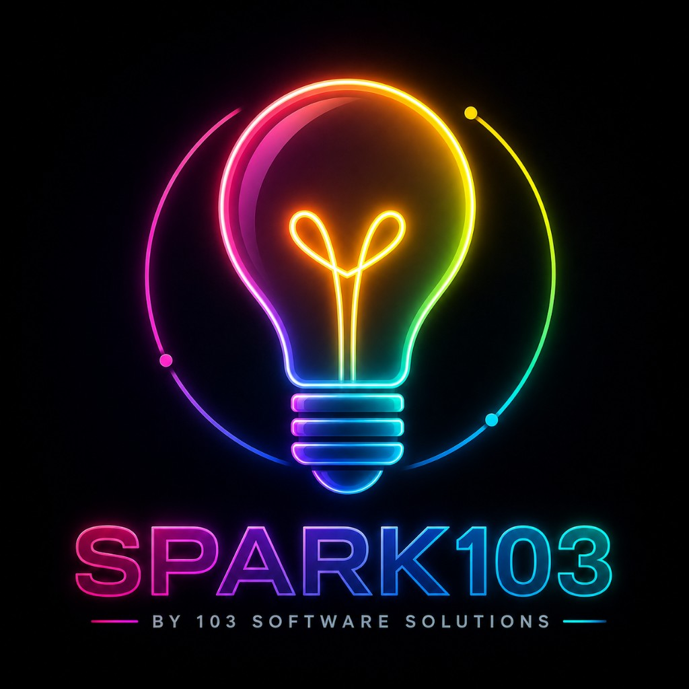

<p align="center">
  
</p>

# Ledger — Lesson Planner

A Vite + React app for creating, organizing, and pacing lesson plans.
Built solo-first, but the data layer is shaped so it can grow into a
multi-teacher / public tool without a rewrite.

## Run it

```bash
npm install
npm run dev
```

## Project Structure

```
lesson-planner/
├── index.html
├── package.json
├── vite.config.js
├── src/
│   ├── main.jsx              # App entry point
│   ├── App.jsx               # Root component
│   ├── components/
│   │   ├── LessonCard.jsx     # List item for lesson preview
│   │   ├── LessonForm.jsx     # Form inputs for lesson details
│   │   ├── LessonWizard.jsx   # Multi-step lesson creation
│   │   ├── Sidebar.jsx        # Navigation sidebar
│   │   └── StandardsEditor.jsx # Standards alignment picker
│   ├── pages/
│   │   ├── Dashboard.jsx      # Main lesson list view
│   │   ├── NewLesson.jsx      # Create new lesson
│   │   ├── LessonDetail.jsx   # View/edit single lesson
│   │   ├── GenerateLesson.jsx # AI lesson generation (prep)
│   │   └── Calendar.jsx       # Weekly pacing view
│   ├── hooks/
│   │   └── useLessonPlans.js  # Data fetching & caching
│   ├── data/
│   │   ├── store.js           # localStorage persistence layer
│   │   ├── schema.js          # Data shape & validation
│   │   ├── standardsFrameworks.js # Standards datasets
│   │   └── generator.js       # Lesson generation utilities
│   └── styles/
│       ├── global.css         # App-wide styles
│       └── tokens.css         # Design tokens (colors, spacing)
└── README.md
```

## What's here (v0.1)

- **Dashboard** (`/`) — searchable, filterable list of all lesson plans (by subject, grade)
- **New / Edit lesson** (`/new`, `/lesson/:id`) — full lesson plan form: objectives, procedure,
  materials, assessment, differentiation, tags
- **Pacing calendar** (`/calendar`) — week view of what's scheduled when
- Data persists to `localStorage` for now (see `src/data/store.js`)

## Designed to extend

- **Standards alignment**: `schema.js` already has a `standards` array on every
  lesson plan (`{ framework, code }`). Add a picker UI backed by a standards
  dataset (Common Core, NGSS, or a state-specific set) whenever you're ready —
  no schema change needed.
- **Multi-user / public**: every plan has `ownerId` and `visibility` fields
  already. Swap `src/data/store.js` internals from `localStorage` to real API
  calls (the functions are already `async`) and add auth — components never
  touch storage directly, so nothing above the store layer changes.
- **Sandboxed dev environments**: `vite.config.js` sets `allowedHosts: true`
  so this runs cleanly behind tunneled preview URLs (E2B, ngrok, etc.) if you
  bring it into Spark103 or another sandbox.

## Subjects

Subject list and color-coding live in `src/data/schema.js` (`SUBJECT_COLORS`).
Edit that object to match what you actually teach.

---

<p align="center">
  <div style="display: flex; justify-content: center; gap: 32px; align-items: center; margin: 24px 0;">
    <div style="text-align: center;">
      
      <p><strong>Ledger</strong></p>
    </div>
    <div style="text-align: center;">
      
      <p><strong>Built with SPARK103</strong></p>
    </div>
  </div>
</p>

**Ledger** — Imagination → Spark → Innovation → Creation.

Built with [SPARK103](https://spark103.dev), a product of 103 Software Solutions LLC.

© 2026 Ledger. This application was generated by SPARK103, a product of 103 Software Solutions LLC. All Rights Reserved.
